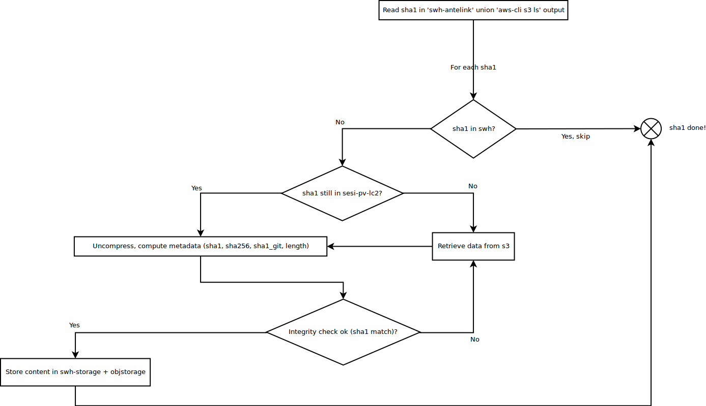

swh-loader-antelink
===================

<!-- markdown-toc start - Don't edit this section. Run M-x markdown-toc-generate-toc again -->
**Table of Contents**

- [swh-loader-antelink](#swh-loader-antelink)
- [Goal](#goal)
- [Status](#status)
- [Notes](#notes)
- [Workflow overview](#workflow-overview)

<!-- markdown-toc end -->

# Goal

The goal of this repository is to retrieve data from antelink's
storage that swh does not already store.

This, in order to reduce the actual cloud service cost of storing
antelink's data.

Out of scope for now:
- The check/deletion of the replicated data from s3 (when the loading
  will be done)
- The metadata information relative to content will be retrieved
  later.


# Status


There exists:
- an old backup on the machine sesi-pv-lc2.inria.fr (sesi-pv-lc2) in
  `/antelink/`
- an `antelink` db on swh's side with one table 'content' with id
  (sha1 of the uncompressed file), path (referencing the path to the
  compressed content on the sesi-pv-lc2 machine).


# Notes


314 899 904 contents are referenced in the table 'content' (db
antelink).  This represents an ideal representation of the backup in
sesi-pv-lc2 but no longer the reality.


But:
- some data have been lost by inria admin back in october/november
  (bad manipulation). Those are to be considered missing.
- some other data may have been corrupted (checksums could no longer
  match)... Those are to be considered missing.

Also:
- the sesi-pv-lc2 is not complete in regards to s3 storage so an
  extract through `aws-cli s3 ls` has been done by Guillaume.
  This is to be used as input in conjunction with the antelink db.
- Bucket s3 contains gzipped contents.
- sesi-pv-lc2 contains gzipped contents.
- the size in the `aws-cli s3 ls` represents the size of the
  compressed data

Implementation detail change in storage:
- A new table `content_large` in swh-storage with the same structure
as content and content_missing will be created.  This table will be
used to store content metadata when the size is larger than our actual
threshold size.
- The antelink content are to be injected as blob

# Workflow overview




# db connection

Ask admin for credential access.

.pgpass:

``` apacheconf
****:****:antelink:guest:****
```

.pg_service.conf:

``` apacheconf
[antelink-swh]
dbname=antelink
host=****
port=****
user=guest
```
